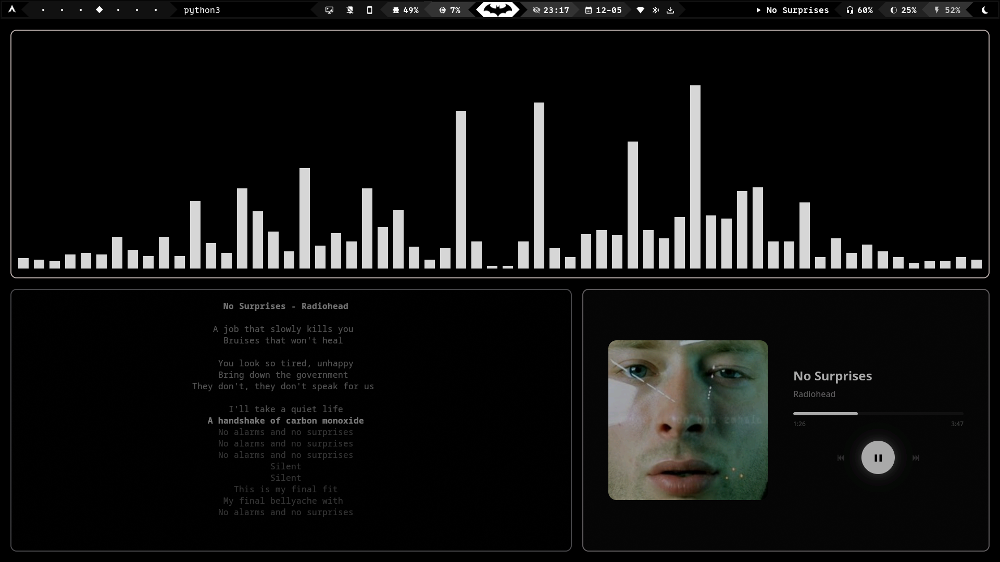

# muser 🎵

> a minimalist music player with a beautiful black & white interface

**vibe coded** with assistance from Google's Antigravity AI

## overview

muser is a lightweight, web-based music player that controls your system's media playback through MPRIS. it features a clean black & white interface designed to match minimal window manager aesthetics (especially hyprland).

## features

- **minimalist design** - pure black & white color scheme
- **mpris integration** - controls any mpris-compatible media player
- **native window** - runs as a standalone app using pywebview
- **album art** - displays local album artwork
- **keyboard shortcuts** - space (play/pause), arrows (prev/next)
- **progress bar** - click to seek
- **real-time updates** - live track info and progress

## architecture

```
┌─────────────────────────────────────────┐
│         PyWebView Window (Qt6)          │
│  ┌───────────────────────────────────┐  │
│  │     web_player.html (UI)          │  │
│  │  - black & white css              │  │
│  │  - javascript for interactivity   │  │
│  └───────────────────────────────────┘  │
│                  ↕                       │
│  ┌───────────────────────────────────┐  │
│  │   Flask Backend (REST API)        │  │
│  │  - serves html/css/js             │  │
│  │  - provides api endpoints         │  │
│  │  - serves local album art         │  │
│  └───────────────────────────────────┘  │
│                  ↕                       │
│  ┌───────────────────────────────────┐  │
│  │   player_backend.py               │  │
│  │  - mpris d-bus integration        │  │
│  │  - media control (play/pause/etc) │  │
│  │  - metadata retrieval             │  │
│  └───────────────────────────────────┘  │
└─────────────────────────────────────────┘
         ↕
┌─────────────────────────────────────────┐
│   system media player (spotify, etc)    │
└─────────────────────────────────────────┘
```

### components

**standalone_app.py**
- main application entry point
- combines flask backend with pywebview frontend
- auto-finds free port to avoid conflicts
- serves local files for album art display

**web_player.html**
- single-page ui with embedded css and javascript
- black & white theme with subtle animations
- responsive design with hover effects
- communicates with flask api via fetch

**player_backend.py**
- interfaces with system media players via mpris (d-bus)
- provides methods: play_pause(), next(), previous(), seek()
- retrieves metadata: title, artist, album art url, duration
- monitors playback status and position

**launcher.py**
- launches the app in background
- attempts to close parent terminal window
- handles process detachment

**muser**
- bash wrapper script
- detects its own directory for portability
- calls launcher.py

## installation

### 1. clone or copy

```bash
cd /path/to/muser
```

### 2. create virtual environment

```bash
python -m venv venv
source venv/bin/activate
```

### 3. install dependencies

```bash
pip install -r requirements.txt
```

### 4. install globally (optional)

```bash
# copy to path
sudo cp muser /usr/local/bin/muser

# or symlink
sudo ln -s $(pwd)/muser /usr/local/bin/muser
```

### 5. install desktop file (for rofi/walker compatibility)

to make muser discoverable by application launchers like rofi, walker, or your desktop environment's app menu:

```bash
# copy the desktop file to local applications directory
cp muser.desktop ~/.local/share/applications/

# update desktop database (optional, speeds up detection)
update-desktop-database ~/.local/share/applications/
```

**note:** if you installed muser to a custom location in step 4, edit `muser.desktop` first and update the `Exec=` line to point to your installation path.

after installation, muser will appear in:
- application launchers (rofi, walker, wofi, etc.)
- desktop environment app menus
- dmenu-style launchers

## usage

### run directly

```bash
./muser
```

### run from anywhere (if installed globally)

```bash
muser
```

### recommended: keybinding

add to your window manager config:

**hyprland** (`~/.config/hypr/hyprland.conf`):
```conf
bind = SUPER, M, exec, muser
```

**i3/sway** (`~/.config/i3/config` or `~/.config/sway/config`):
```conf
bindsym $mod+m exec muser
```
## ui
Here's a glimpse of muser's minimalist UI, designed for clarity and essential media control. along with [cava](https://github.com/karlstav/cava) and [sptlrx-scaled](https://github.com/users/umersanii/sptlrx-scaled),



## requirements

- python 3.8+
- mpris-compatible media player (spotify, vlc, firefox, etc)
- linux with d-bus
- qt6 or gtk (for pywebview)

## dependencies

- **flask** - web backend
- **flask-cors** - cross-origin support
- **pywebview** - native window wrapper
- **pyqt6** - gui backend for pywebview
- **pillow** - image processing
- **requests** - http requests
- **psutil** - process management

## acknowledgements

this project was **vibe coded** with assistance from google's antigravity ai.

### inspiration & references

- **mpris specification** - freedesktop.org mpris d-bus interface
- **pywebview** - [github.com/r0x0r/pywebview](https://github.com/r0x0r/pywebview)
- **flask** - [flask.palletsprojects.com](https://flask.palletsprojects.com/)

### design philosophy

inspired by minimal window manager aesthetics, particularly hyprland and sway setups. the black & white color scheme prioritizes clarity and reduces visual noise.

## troubleshooting

### app doesn't start

ensure you have a media player running:
```bash
# check for mpris players
dbus-send --session --dest=org.freedesktop.DBus --type=method_call --print-reply /org/freedesktop/DBus org.freedesktop.DBus.ListNames | grep mpris
```

### no album art

album art requires local file access. web urls work automatically, but `file://` urls are converted to flask-served endpoints.

### terminal doesn't close

this is expected behavior. use a keybinding or application launcher instead of running from terminal.

### port conflict

the app auto-finds a free port. if issues persist, check for other flask apps running.

## license

mit

## contributing

this was a vibe coding session, but feel free to fork and improve!

---

**made with ❤️ and ai assistance**
